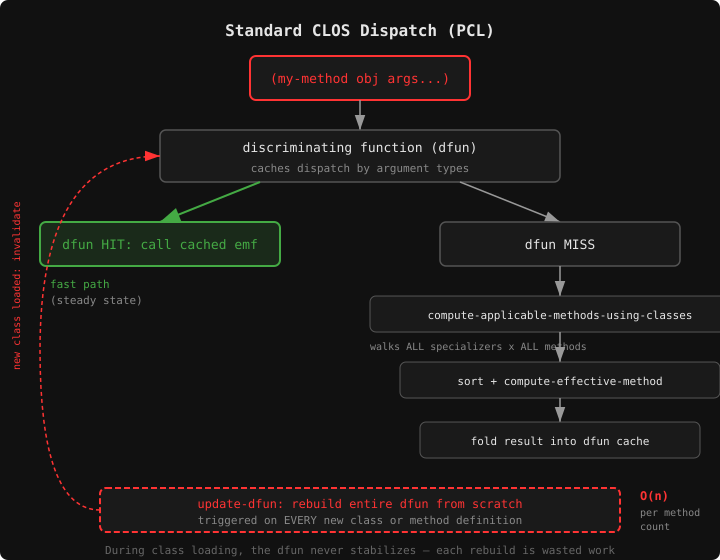
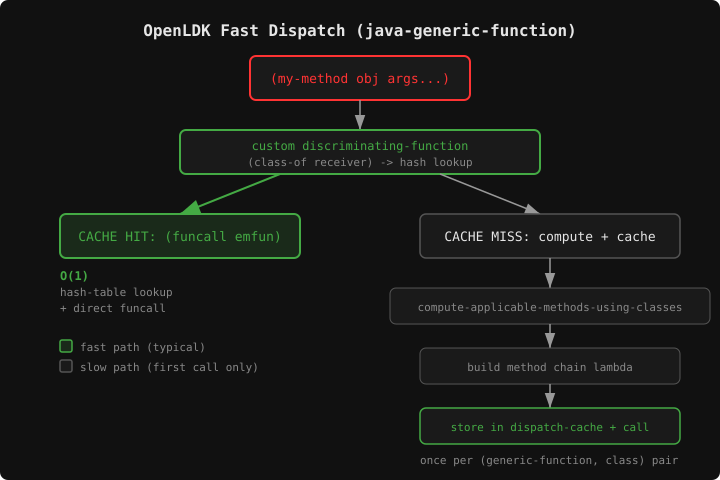
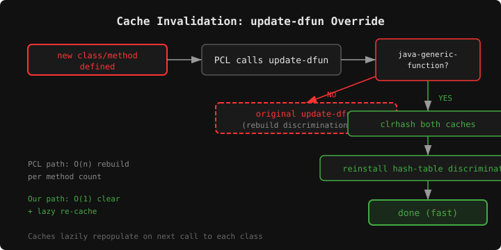

I hit a wall while getting [Clojure](https://clojure.org) running on [OpenLDK](https://github.com/atgreen/openldk), my Common Lisp JVM. It was taking almost three hours to get to a Clojure REPL prompt. Profiling showed that huge chunks of that time were spent in `invoke-special`, buried deep in SBCL's PCL implementation, trying to sort through thousands of methods for `<init>()`. The JVM constructor. Every Java class has one, and in Clojure every function is its own class.

The problem is a fundamental impedance mismatch: CLOS does multi-method dispatch — it considers the types of *all* arguments when selecting a method. Java does single dispatch — only the receiver object's type matters. OpenLDK maps Java classes to CLOS classes and Java virtual methods to CLOS generic functions, which means every Java method call pays the full cost of CLOS's multi-dispatch protocol. For a handful of classes, nobody notices. For the ~3000 classes Clojure loads at startup, it's a catastrophe.

The fix was to reach into the CLOS Meta-Object Protocol and replace the dispatch machinery for Java methods with something that actually matches Java's dispatch model.

### A Quick Tour of CLOS Dispatch

SBCL's PCL (Portable Common Loops) implements the MOP's dispatch protocol. When you call a generic function, PCL routes the call through a **discriminating function** — an internal function that PCL attaches to each generic function object. The discriminating function embodies a **discrimination net** (dfun), a caching structure that tries to fast-path calls based on argument types it has seen before.



On a dfun cache miss, PCL falls back to the full MOP protocol: **`compute-applicable-methods-using-classes`** examines the class of *every* specializable argument against *every* defined method's specializers, the matching methods are **sorted by specificity** across all argument positions, and PCL builds an **effective method** — a compiled function that chains the primary and auxiliary methods together with `call-next-method` support. The result is folded back into the dfun so the next call with the same types is fast.

In steady state this works fine. The problem is what happens when the method set changes. Every time you add a method or define a new class, PCL calls `update-dfun`, which recomputes the discriminating function and updates the dfun's internal caching structures. During Clojure bootstrap, we're loading classes in a tight loop — each class definition triggers `update-dfun` on every generic function that has methods specializing on that class or its ancestors. With thousands of methods on `<init>()`, the full MOP protocol runs on every cache miss, and the caches are constantly being invalidated. The cost adds up fast.

### What Java Actually Needs

Java's virtual dispatch is simple: look at the receiver object's class, walk up the class hierarchy until you find a matching method, done. There's no consideration of the other arguments' types. This is textbook single dispatch, and it has a textbook optimization: a cache keyed on the receiver's class.

That's exactly what I built.

### The `java-generic-function` Metaclass

The MOP lets you subclass `standard-generic-function` to change how dispatch works. I defined a new metaclass with two hash-table caches and a lock:

```lisp
(defclass java-generic-function (standard-generic-function)
  ((dispatch-cache :initform (make-hash-table :test 'eq)
                   :accessor java-gf-dispatch-cache)
   (invoke-special-cache :initform (make-hash-table :test 'eq)
                         :accessor java-gf-invoke-special-cache)
   (cache-lock :initform (bordeaux-threads:make-lock "java-gf-cache")
               :reader java-gf-cache-lock))
  (:metaclass sb-mop:funcallable-standard-class))
```

The `dispatch-cache` maps a receiver class to a pre-built effective method function. The `invoke-special-cache` does the same thing for `invokespecial` bytecode — Java's mechanism for calling a specific parent class's method (constructors, `super` calls). The lock is there because OpenLDK can load classes from multiple threads.

### Replacing the Discriminating Function

The MOP protocol for customizing dispatch is `compute-discriminating-function`. I specialize it on `java-generic-function` to return a lambda that does a hash-table lookup instead of walking the full MOP dispatch chain:

```lisp
(defmethod closer-mop:compute-discriminating-function
    ((gf java-generic-function))
  (let ((cache (java-gf-dispatch-cache gf))
        (lock (java-gf-cache-lock gf)))
    (lambda (&rest args)
      (let* ((receiver (first args))
             (class (class-of receiver))
             (emfun (gethash class cache)))
        (if emfun
            (funcall emfun args)
            (let ((new-emfun (%compute-java-effective-method gf class)))
              (bordeaux-threads:with-lock-held (lock)
                (setf (gethash class cache) new-emfun))
              (funcall new-emfun args)))))))
```

On a cache hit, it's two operations: `class-of` and a hash lookup. On a miss (the first call for each receiver class), it computes the effective method, caches it, and calls it. After that, every subsequent call for that class is O(1). This is where the real performance win lives — replacing PCL's multi-dispatch dfun machinery with a single-dispatch hash-table cache.



The cache miss path calls `%compute-java-effective-method`, which does call `compute-applicable-methods-using-classes` — but only once per (generic-function, receiver-class) pair between invalidations:

```lisp
(defun %compute-java-effective-method (gf class)
  (let* ((lambda-list (closer-mop:generic-function-lambda-list gf))
         (nargs (length lambda-list))
         (class-list (cons class
                          (make-list (max 0 (1- nargs))
                                     :initial-element (find-class 't)))))
    (multiple-value-bind (methods definitive-p)
        (closer-mop:compute-applicable-methods-using-classes gf class-list)
      (declare (ignore definitive-p))
      (if (null methods)
          (lambda (args)
            (apply #'no-applicable-method gf args))
          (let* ((around (remove-if-not
                          (lambda (m) (equal (method-qualifiers m) '(:around)))
                          methods))
                 (primary (remove-if-not
                           (lambda (m) (null (method-qualifiers m)))
                           methods))
                 (chain (append around primary)))
            (if (null chain)
                (lambda (args)
                  (apply #'no-applicable-method gf args))
                (let ((first-mf (closer-mop:method-function (first chain)))
                      (rest-chain (rest chain)))
                  (lambda (args)
                    (funcall first-mf args rest-chain)))))))))
```

The trick with `class-list` is key: I only specialize on the receiver's actual class. Every other argument position gets `T`, the universal supertype. This tells the MOP "I don't care about these arguments for dispatch purposes" — which is exactly Java's single-dispatch semantics.

### Cache Invalidation

When methods are added, removed, or relevant classes are defined, SBCL's PCL calls `update-dfun` on the affected generic functions. For a `java-generic-function`, `update-dfun` calls our `compute-discriminating-function` — which is constant-time — and installs the result. No expensive discrimination net is rebuilt, because we've already replaced the dispatch machinery.

But there's a subtlety: the discriminating function closes over the *same* hash-table objects in the GF's slots. If we don't clear those caches, stale effective methods will persist after the method set changes. The fix is to clear both caches inside `compute-discriminating-function` itself, since SBCL's `update-dfun` calls it whenever invalidation is needed:

```lisp
(defmethod closer-mop:compute-discriminating-function ((gf java-generic-function))
  (let ((cache (java-gf-dispatch-cache gf))
        (special-cache (java-gf-invoke-special-cache gf))
        (lock (java-gf-cache-lock gf)))
    ;; Clear stale caches — SBCL's update-dfun calls this whenever
    ;; the method set changes.
    (bordeaux-threads:with-lock-held (lock)
      (clrhash cache)
      (clrhash special-cache))
    (lambda (&rest args)
      (let* ((receiver (first args))
             (class (class-of receiver))
             (emfun (gethash class cache)))
        (if emfun
            (funcall emfun args)
            (let ((new-emfun (%compute-java-effective-method gf class)))
              (bordeaux-threads:with-lock-held (lock)
                (setf (gethash class cache) new-emfun))
              (funcall new-emfun args)))))))
```



The caches repopulate lazily on the next call for each receiver class. This keeps invalidation O(1) — a pair of hash-table clears — and the refill cost is amortized across subsequent calls.

An earlier version of this code overrode SBCL's internal `sb-pcl::update-dfun` function directly, but [Christophe Rhodes pointed out](https://github.com/atgreen/openldk/issues/10) that this is unnecessary: since our `compute-discriminating-function` is already constant-time, `update-dfun` doesn't do any expensive work for `java-generic-function` instances. Moving the cache clearing into `compute-discriminating-function` where it belongs eliminated the need to touch PCL internals at all.

### Pre-Creating Hot Generic Functions

Not all generic functions are equal. `<init>()` is the single hottest one — every Java object creation calls it. I pre-create it (and a few others) with the `java-generic-function` metaclass during bootstrap, before any classes are loaded:

```lisp
(ensure-generic-function '|<init>()|
                         :generic-function-class 'java-generic-function
                         :lambda-list '(|this|))

(ensure-generic-function '|clone()|
                         :generic-function-class 'java-generic-function
                         :lambda-list '(|this|))
```

And in the code generator, every Java instance method gets its generic function pre-created with the fast metaclass:

```lisp
(unless (and (fboundp method-name)
             (typep (symbol-function method-name) 'generic-function))
  (ensure-generic-function method-name
    :generic-function-class 'java-generic-function
    :lambda-list (cons 'this arg-names)))
```

This guarantees that no Java method ever falls through to PCL's default dispatch machinery.

### `invokespecial` Caching

Java's `invokespecial` instruction is used for constructor chaining and `super` calls. It bypasses virtual dispatch and targets a specific class's method. During Clojure bootstrap, constructor chains like `Object.<init>` → `AbstractCollection.<init>` → `AbstractList.<init>` → ... fire constantly.

I added a second cache specifically for this pattern:

```lisp
(defun invoke-special (method-symbol owner-symbol args)
  (let* ((gf (symbol-function method-symbol))
         (owner-class (find-class owner-symbol)))
    (when (typep gf 'java-generic-function)
      (let* ((cache (java-gf-invoke-special-cache gf))
             (entry (gethash owner-class cache)))
        (unless entry
          (setf entry (%compute-invoke-special-entry
                        gf owner-class (length args)))
          (when entry
            (bordeaux-threads:with-lock-held ((java-gf-cache-lock gf))
              (setf (gethash owner-class cache) entry))))
        (when entry
          (return-from invoke-special
            (funcall (car entry) args (cdr entry))))))
    ;; fallback to full MOP lookup for non-java-generic-functions
    ...))
```

Each cache entry is a cons of `(method-function . next-methods)`, so calling a cached `invokespecial` is a single `funcall`.

### The Payoff

This work was motivated by [cl-clojure](https://github.com/atgreen/cl-clojure), a project that runs Clojure inside Common Lisp via OpenLDK. Clojure's bootstrap loads a massive number of classes — the core library alone defines hundreds of `IFn` implementations, each with `invoke` methods at multiple arities. Without the MOP customization, PCL spent more time rebuilding discrimination nets than doing useful work. With it, getting to a Clojure REPL went from 2 hours 45 minutes to 2 minutes 40 seconds.

The whole fix is about 100 lines of Common Lisp in a single file (`src/java-gf.lisp`), plus a few `ensure-generic-function` calls sprinkled through the bootstrap code. It doesn't touch any SBCL internals, and it leaves all non-Java generic functions completely untouched.

What I like about this solution is that it's the MOP working as designed. Gregor Kiczales and the AMOP authors built the Meta-Object Protocol specifically so you could do this kind of thing — swap out pieces of the object system's implementation without forking the runtime. I didn't patch SBCL. I didn't write a custom compiler. I subclassed `standard-generic-function` and specialized two MOP generic functions (`compute-discriminating-function` and `compute-applicable-methods-using-classes` via `%compute-java-effective-method`). The rest of CLOS keeps working exactly as before.

The source is at [github.com/atgreen/openldk](https://github.com/atgreen/openldk).

Discuss on [Hacker News](https://news.ycombinator.com/item?id=47114131).
