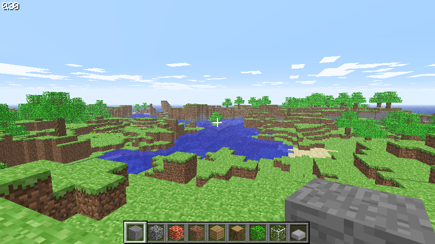

Just a little progress report today.  I haven't really touched
[OpenLDK](https://github.com/atgreen/openldk) in a while, but [Nick
Faro](https://github.com/SuperDisk) has been very busy with it!

Nick managed to get an early version of Minecraft running on SBCL using OpenLDK.
OpenLDK JIT-transpiles Java bytecode into Common Lisp for execution on SBCL.

Nick had to do a little hacking to fix bugs (which I'm merging), as
well as some tricks to get graphics working (unsure about merging
those).  You can read about it in [OpenLDK issue
#11](https://github.com/atgreen/openldk/issues/11).

Nice work, Nick!

