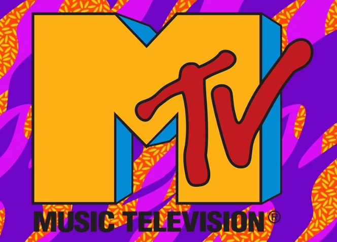

After 44 years, MTV just [shut down its remaining music channels](https://collider.com/mtv-officially-dead-shutting-down-all-music-only-channels/). End of an era.

I grew up with MuchMusic in Toronto, but during my years in Silicon Valley I got my share of MTV too. And once, I was actually on it.

It was MTV Netherlands. Their VJ at the time, Fleur van de Kieft, was leading a crew on a road trip through California, shooting segments for her show. They were visiting tech companies, and Red Hat was on the list. My buddy Kim and I got tapped for the interview.

It was the weirdest thing. Fleur would ask about Open Source - how can a company be successful by giving away the software for free? We'd take turns answering for about 30 seconds. Then she'd turn to the camera and throw it to different Janet Jackson videos in Dutch.

It was surreal. I have no idea if we made any sense at all, or if Dutch viewers came away more confused than before. But somewhere out there, that footage existed - a little slice of early 2000s tech evangelism, MTV style.

RIP MTV.
